# street_art_classifier
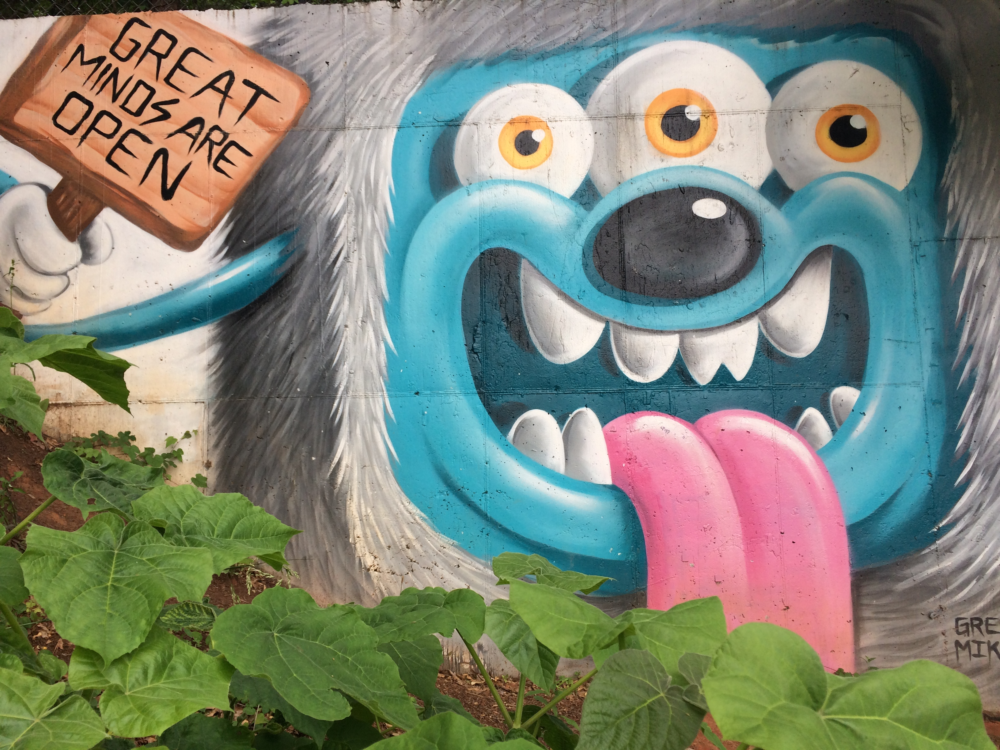

Creating a Convolutional Neural Net that can classify street art styles.

## Table of Contents

1. [Description](#description)
2. [Repo Instructions](#repo)
3. [Web Scraping](#WS)
4. [Data Processing](#dp)
5. [Results](#results)
6. [Summary](#summary)
7. [Next Steps](#next)
8. [Technologies Use](#tech)

# Description
The goal of this project was to build a convolutional neural network that could classify pictures of street art by their style. I scrapped the FatCap website, a graffitti website that has been around from 1998 and contained over 22,000 images from across the globe. I chose to use this website becuase with each image users upload artist, location, and style. This gave me options on what I could train the model to look for. I started with a simple two class model and built up to 6 classes. 

# Repo Overview
Run these scripts in this order to duplicate my results

    1. art_collecting.py - The web scraping script
    2. folder_splitting.py - Divides the selected images into train, test, val folders
    3. image_processing.py - Balances the number of images in each class through image augmentation
    4. street_art_cnn.py - Creates the models using tensorflow
    5. plotting_and_visualizing.py = Allows you to see incorrect images and confusion matrixes

# Web scraping
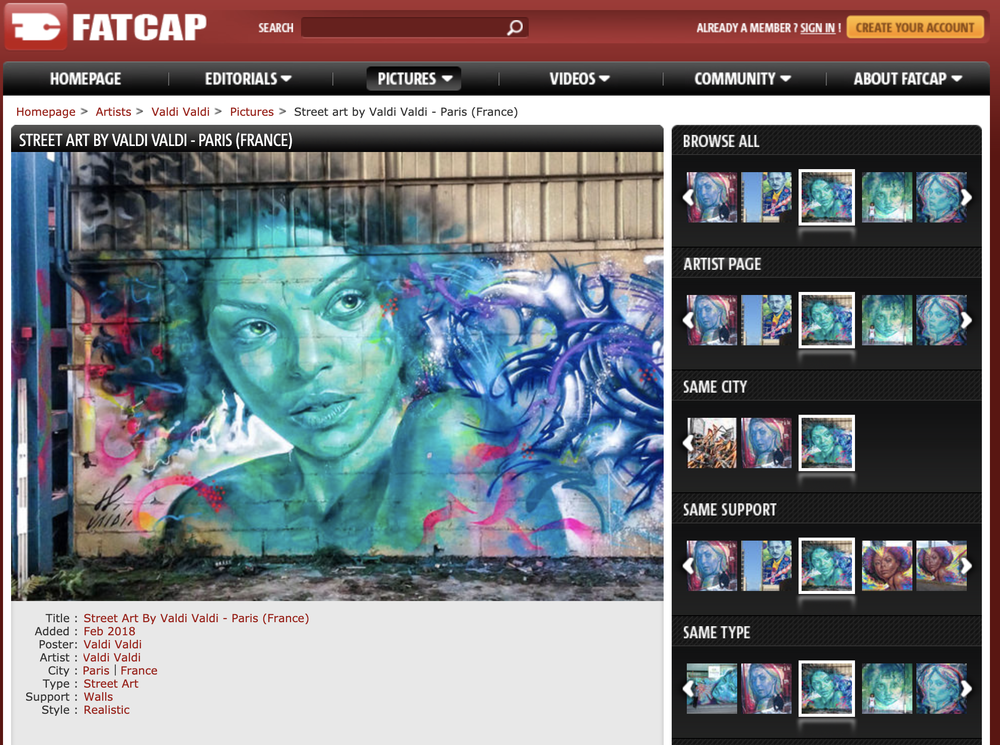

In addition to the image I scraped the meta data available in each page. This gave me options on what I could train the model on. (I think classification by location could be an interesting continuation to this project)

You'll notice one of the labels on the page is "support". This is actually the surface that the street art is created on. Options range from train cars to walls to body art. I wanted the classifier to learn based on the art style, not the structure it was painted on, so I limited my data to only the art done on walls.

### Data Overview

 
|  Style | Total Images  |  Wall Only |   
|--------|---------------|------------|
|  Wildstyle | 3131  | 2656 | 
|  Realistic | 2026  | 1441 | 
|  Cartoon | 2183  | 1634 | 
|  3D | 1015  | 769 | 
|  Abstract | 1603  | 784 | 
|  Brush | 867  | 243 | 
|  Bubble | 557 | 165 | 
 

# Images of each Style

---Wildstyle is a complicated and intricate form of graffiti. Due to its complexity, it is often very hard to read by people who are not familiar with it. Usually, this form of graffiti incorporates interwoven and overlapping letters and shapes. It may include arrows, spikes, and other decorative elements depending on the technique used. The numerous layers and shapes make this style extremely difficult to produce homogeneously, which is why developing an original style in this field is seen as one of the greatest artistic challenges to a graffiti writer. Wildstyle pieces are the most complex form of piece ("masterpiece") lettering, a stage higher than the quick simplified stylised letters known as "burners". Wildstyle is seen as one of the most complicated and difficult masterpiece styles and refers to larger complex letters which have volume as opposed to mere signatures or graffiti art "tags".--- Wikipedia

I decided to focus on Wildstyle and Realistic at the start both because they have the largest sample size out of the 18 styles, but also because they are very different from each other. Wildstyle is much more geometric and sharp lines focused on letters. Realistic is more portraits and landscapes. 
Data

## Inbalanced Classes
How to deal with inbalanced classes - I wrote a script to balance them through image augmentation. (Oversampling)

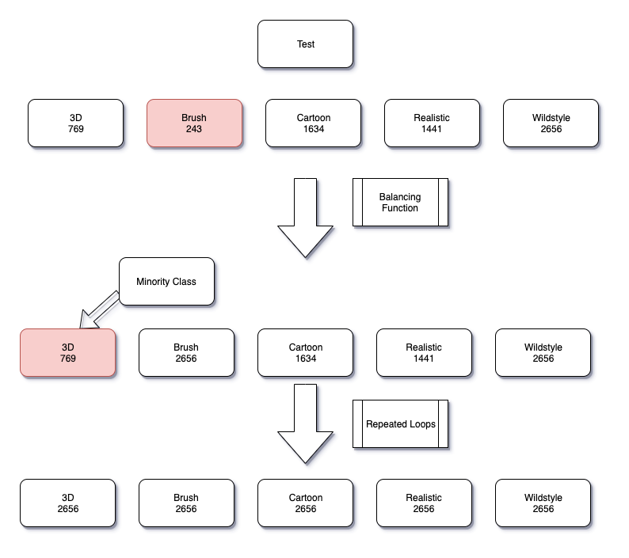

## Model With Two Classes
I chose to start with two classes that had the largest number of images and were very different from each other. Wildstyle is a geometric tagging style while Realistic is more standard images. To a person they are very distinct. How well can a computer tell them apart?

The best model I achieved with just two classes had a loss of 0.2809 and an accuracy of .8929 on the validation set of images. It was run for 3 epochs with an image size of 150x150, 64 nuerons, 16 batch size, and relu activation. I tested many variations on those parameters to come to this model. I selected these settings by trial and error.

What the model sees vs what the actual image is.

What the Model Sees |  Actual Image
:-------------------------:|:-------------------------:
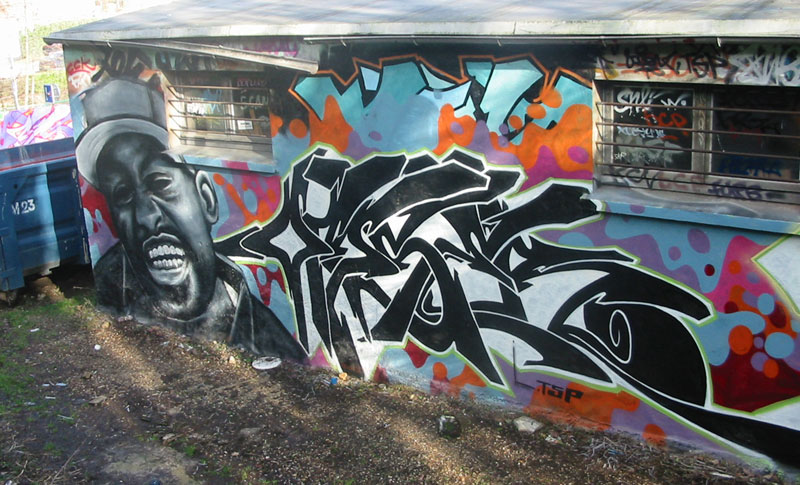| 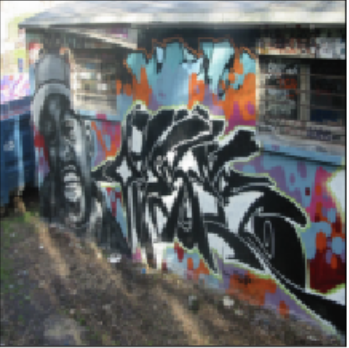|

### Confusion Matrix
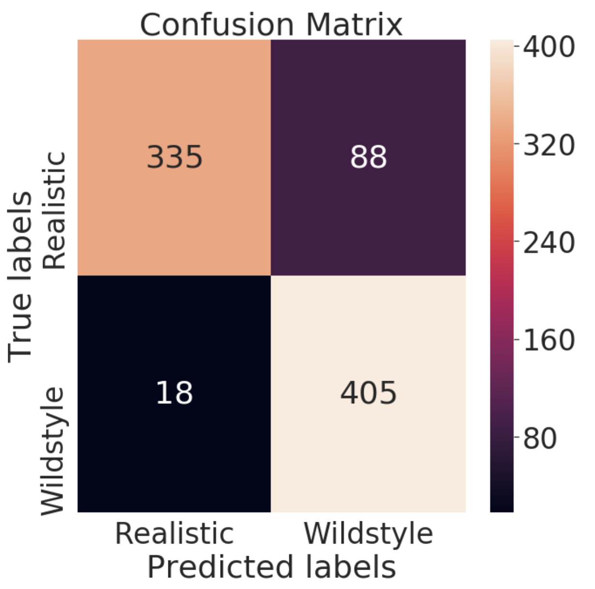

The biggest area of error was predicting Wildstyle when it was actually Realistic. Let's look at some incorrect images to see if we could see why.

## Images it got wrong

Realistic labeled as Wildstyle |  Even Split
:-------------------------:|:-------------------------:
 Realistic: 0.0306063  Wildstyle: 0.99052274  Actual - Realistic |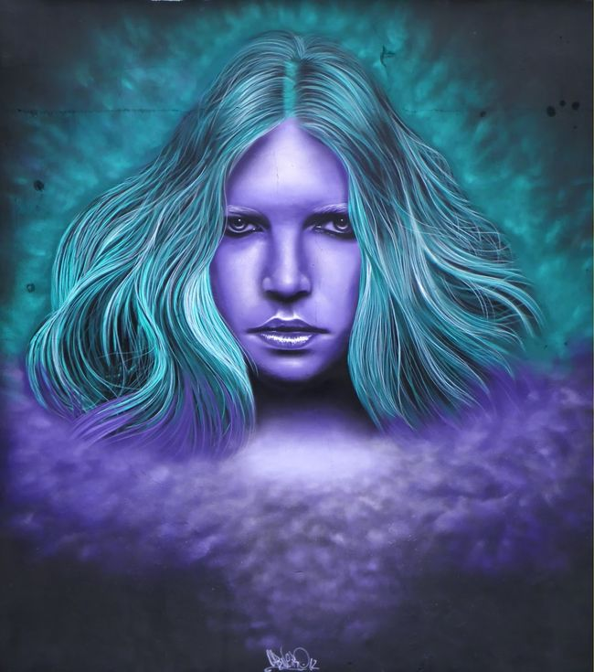Realistic: 0.42339113 Wildstyle: 0.51157093 Actual - Realistic|

The image on the left was labeled realistic by whoever submitted to the website. While there are realistic parts of the image I feel like the Wildstyle section is most prominent. I would consider this a mislabel in the training data.

The image on the right was a near even split. I am not sure what it is picking up for Wildstyle since none of the patterns I hypothesized would define Wildstyle are present.

Mislabeled Realistic |  Actual Bad Prediction
:-------------------------:|:-------------------------:
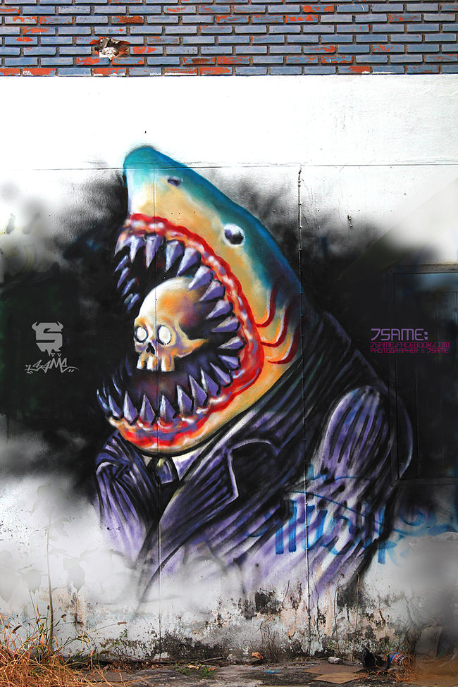 Realistic: 0.93985313 Wildstyle: 0.2017667 Actual - Wildstyle|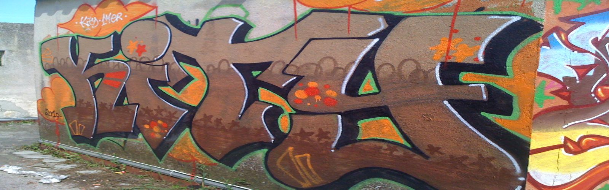Realistic: 0.7181519 Wildstyle: 0.12843975 Actual - Wildstyle|

Again, the image on the left appears to have been mislabeled in the original training data.

This picture on the right actually puzzels me. It appears to be a correct label in the original data, but I am not sure why the model classifies it as realistic. My current hypothesis is that it does not have enough sharp turns. (I would actually label this bubble style, but that was not a classification in the model)

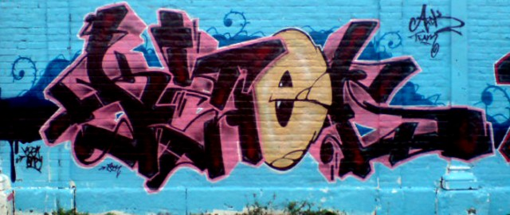 Realistic: 0.50048065 Wildstyle: 0.4919799 Actual - Wildstyle

# Model With 5 Classes

## Confusion Matrix
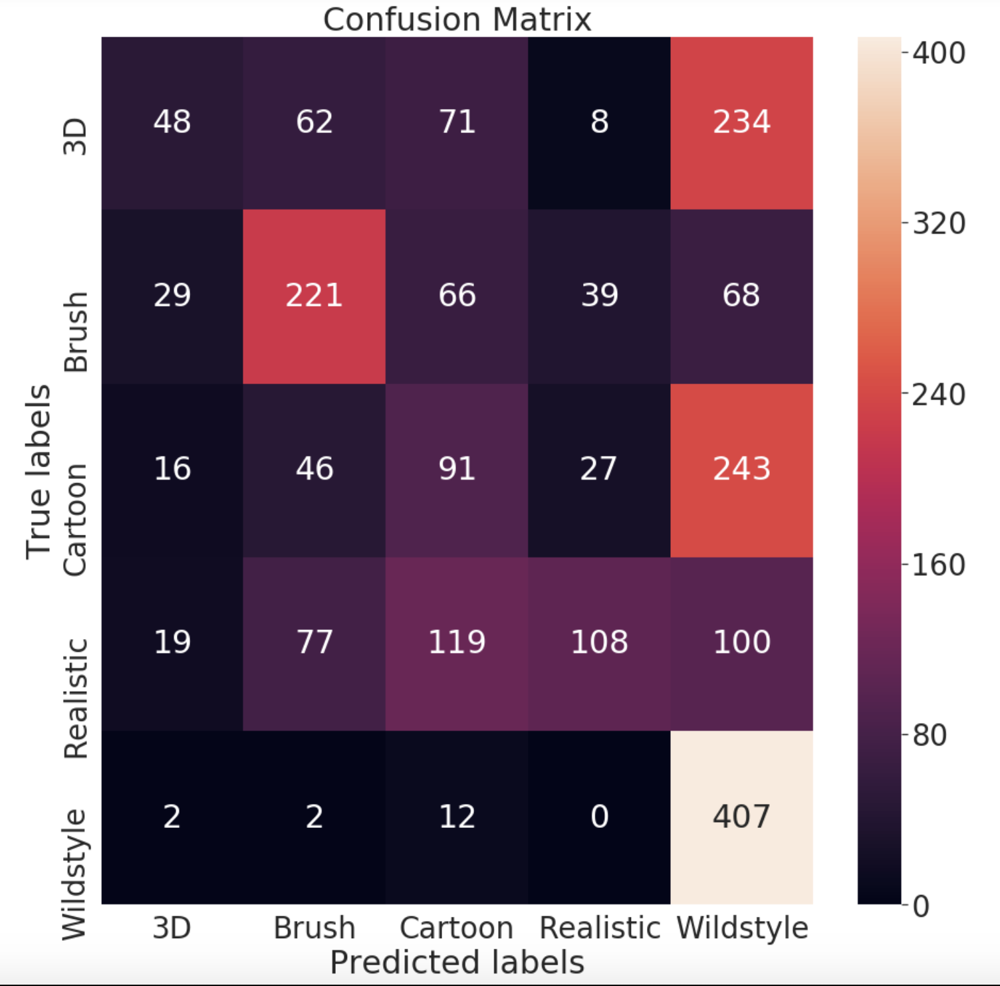

Images it got wrong
Which classes got confused together

# Model with 6 Classes

#Running it on my own pictures