# street_art_classifier
Creating a Convolutional Neural Net that can classify street art styles.

## Table of Contents

1. [Description](#description)
2. [Repo Instructions](#repo)
3. [Web Scraping](#WS)
4. [Images of each Style](#is)
5. [Imbalanced Classes](#ib)
6. [Model With Two Classes](#2m)
7. [Model With Five Classes](#5m)
8. [My Own Pictures](#op)
9. [Conclusions](#con)

# Description
The goal of this project was to build a convolutional neural network that could classify pictures of street art by their style. I scrapped the FatCap website, a graffiti  website that has been around from 1998 and contained over 22,000 images from across the globe. I chose to use this website because with each image users upload artist, location, and style. This gave me options on what I could train the model to look for. I started with a simple two class model and built up to 6 classes. 

# Repo Overview
Run these scripts in this order to duplicate my results

    1. art_collecting.py - The web scraping script
    2. folder_splitting.py - Divides the selected images into train, test, val folders
    3. image_processing.py - Balances the number of images in each class through image augmentation
    4. street_art_cnn.py - Creates the models using tensorflow
    5. plotting_and_visualizing.py = Allows you to see incorrect images and confusion matrixes

# Web scraping

In addition to the image I scraped the meta data available in each page. This gave me options on what I could train the model on. (I think classification by location could be an interesting continuation to this project)

You'll notice one of the labels on the page is "support". This is actually the surface that the street art is created on. Options range from train cars to walls to body art. I wanted the classifier to learn based on the art style, not the structure it was painted on, so I limited my data to only the art done on walls.

### Data Overview

|  Style | Total Images  |  Wall Only |   
|--------|---------------|------------|
|  Wildstyle | 3131  | 2656 | 
|  Realistic | 2026  | 1441 | 
|  Cartoon | 2183  | 1634 | 
|  3D | 1015  | 769 | 
|  Abstract | 1603  | 784 | 
|  Brush | 867  | 243 | 
|  Bubble | 557 | 165 | 

# Images of each Style

*Wildstyle is a complicated and intricate form of graffiti. Due to its complexity, it is often very hard to read by people who are not familiar with it. Usually, this form of graffiti incorporates interwoven and overlapping letters and shapes. It may include arrows, spikes, and other decorative elements depending on the technique used. The numerous layers and shapes make this style extremely difficult to produce homogeneously, which is why developing an original style in this field is seen as one of the greatest artistic challenges to a graffiti writer. Wildstyle pieces are the most complex form of piece ("masterpiece") lettering, a stage higher than the quick simplified stylised letters known as "burners". Wildstyle is seen as one of the most complicated and difficult masterpiece styles and refers to larger complex letters which have volume as opposed to mere signatures or graffiti art "tags"* - Wikipedia

Wildstyle |  Realistic | 3D
:-------------------------:|:-------------------------:|:-------------------------:
| | 

Bubble |  Cartoon | Brush
:-------------------------:|:-------------------------:|:-------------------------:
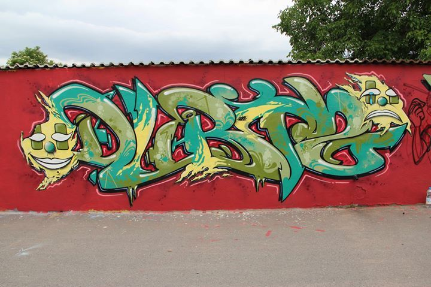| | 

## Inbalanced Classes

Even in the case of my two most popular image classes I still have a significant imbalance in the classes. Since I was working with a very small dataset to begin with I did not want to take images out. Instead of undersampling I decided to oversample my minority class. I wrote a script to balance them through image augmentation. (Oversampling)

This worked well and allowed me to trust my model results better. (This library might also get the same results- https://imbalanced-learn.readthedocs.io/en/stable/)

When deciding how to augment the images I decided that color could be a factor in street art styles. Just to my human eye Cartoon seems to use lighter, but vibrant colors, while realistic uses darker more natural colors. I also limited the amount of rotation possible. The street art I am looking at is on large stationary walls, which would limit the perspectives someone might take a picture from. I also included zooming, shifts, and shears. 

# Model With Two Classes

I decided to focus on Wildstyle and Realistic at the start both because they have the largest sample size out of the 18 styles, but also because they are very different from each other. Wildstyle is much more geometric and sharp lines focused on letters. Realistic is more portraits and landscapes. To a person they are very distinct. How well can a computer tell them apart?

The best model I achieved with just two classes had a loss of 0.2809 and an accuracy of .8929 on the validation set of images. It was run for 3 epochs with an image size of 150x150, 64 neurons, 16 batch size, and relu activation. I tested many variations on those parameters to come to this model. I selected these settings by trial and error.

What the model sees vs what the actual image is.

What the Model Sees |  Actual Image
:-------------------------:|:-------------------------:
| |

### Confusion Matrix

The biggest area of error was predicting Wildstyle when it was actually Realistic. Let's look at some incorrect images to see if we could see why.

## Images it got wrong

Realistic labeled as Wildstyle |  Even Split
:-------------------------:|:-------------------------:
 Realistic: 0.0306063  Wildstyle: 0.99052274  Actual - Realistic |Realistic: 0.42339113 Wildstyle: 0.51157093 Actual - Realistic|

The image on the left was labeled realistic by whoever submitted to the website. While there are realistic parts of the image I feel like the Wildstyle section is most prominent. I would consider this a mislabel in the training data.

The image on the right was a near even split. I am not sure what it is picking up for Wildstyle since none of the patterns I hypothesized would define Wildstyle are present.

Mislabeled Realistic |  Actual Bad Prediction
:-------------------------:|:-------------------------:
 Realistic: 0.93985313 Wildstyle: 0.2017667 Actual - Wildstyle|Realistic: 0.7181519 Wildstyle: 0.12843975 Actual - Wildstyle|

Again, the image on the left appears to have been mislabeled in the original training data.

This picture on the right actually puzzles me. It appears to be a correct label in the original data, but I am not sure why the model classifies it as realistic. My current hypothesis is that it does not have enough sharp turns. (I would actually label this bubble style, but that was not a classification in the model)

 Realistic: 0.50048065 Wildstyle: 0.4919799 Actual - Wildstyle

# Model With 5 Classes

Since the two class model was working well I added in the other classes and ran that. Using similar parameters as the 2 class model I achieved a loss of 1.4151 and an accuracy of 0.4098. It was a significant drop. 

## Confusion Matrix

## Images it got wrong

Mislabeled Realistic |  Mislabeled Realistic
:-------------------------:|:-------------------------:
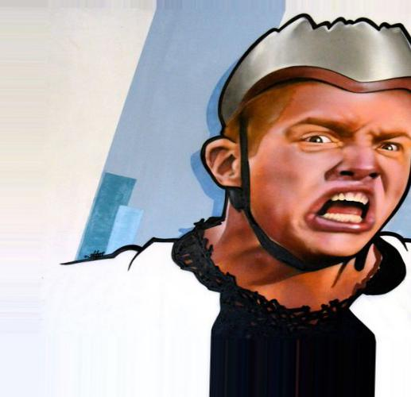 Cartoon:0.2627398 Realistic: 0.13486318 3d: 0.34537324 Wildstyle: 0.23762368 Brush: 0.019400047  Actual - Realistic|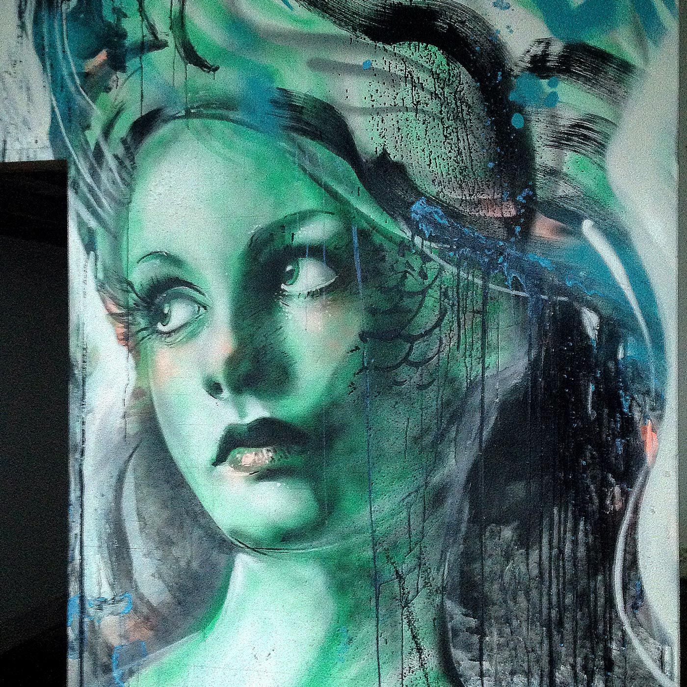Cartoon: 0.124098696 Realistic: 0.023864416 3d: 0.3411724 Wildstyle: 0.23247054 Brush: 0.27839395 Actual - Realistic

Mislabeled Cartoon |  Mislabeled Cartoon
:-------------------------:|:-------------------------:
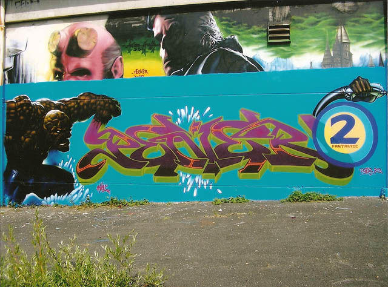 Cartoon: 0.017569901 Realistic: 0.0019160191 3d: 0.15066631 Wildstyle: 0.0131484615 Brush: 0.8166993 Actual - Cartoon|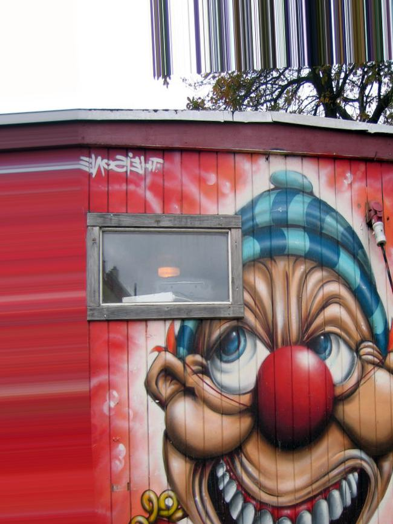Cartoon: 0.21041466 Realistic: 0.56883746 3d: 0.14603281 Wildstyle: 0.06387186 Brush: 0.010843233 Actual - Cartoon

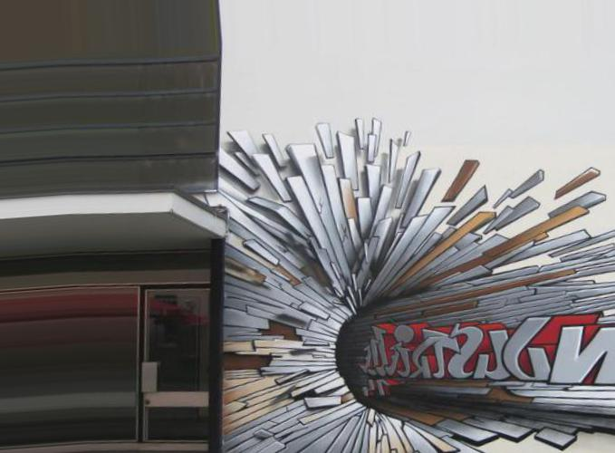

Cartoon: 0.29667053 
Realistic: 0.5188742 
3d: 0.11701635 
Wildstyle: 0.05458926 
Brush: 0.012849702 
Actual - 3d

# Running it on my own pictures

Last night I ran a 6 class model with a Loss of 1.79 and an Accuracy 0.42. Ran for 50 epochs and 5 hours. I also chose a couple of different categories. While I didn't have time to do much EDA on this model, I did use it to test my own pictures. Here are those results.

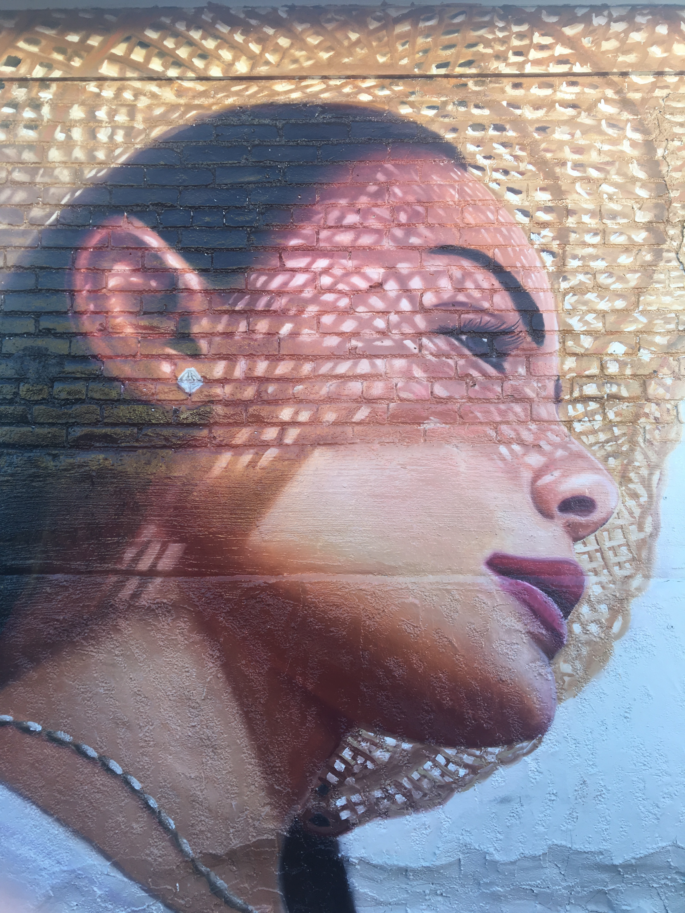3D: 0.054 Abstract: 0.035 Bubble: 0.000 Cartoon: 0.158 Realistic: 0.739 Wildstyle: 0.014

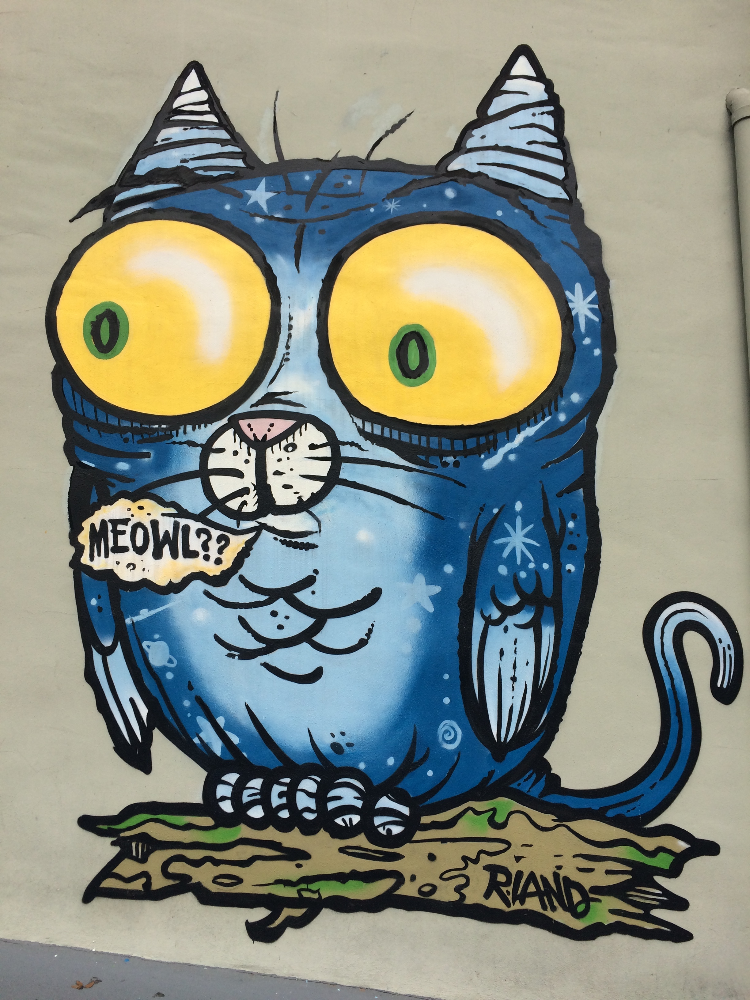3D: 0.037 Abstract: 0.314 Bubble: 0.000 Cartoon: 0.338 Realistic: 0.009 Wildstyle: 0.303

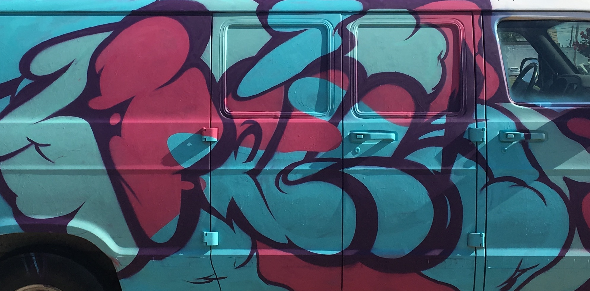3D: 0.444 Abstract: 0.161 Bubble: 0.247 Cartoon: 0.112 Realistic: 0.012 Wildstyle: 0.023

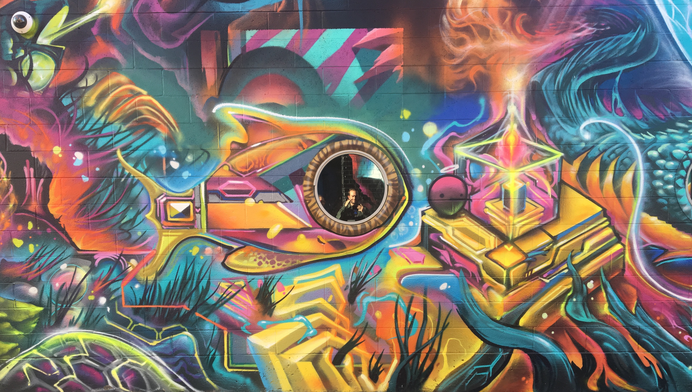3D: 0.145 Abstract: 0.163 Bubble: 0.037 Cartoon: 0.336 Realistic: 0.209 Wildstyle: 0.110

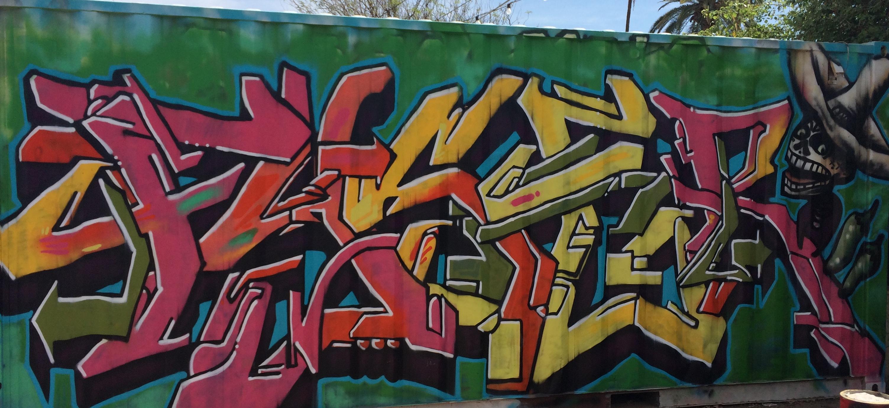3D: 0.196 Abstract: 0.032 Bubble: 0.038 Cartoon: 0.284 Realistic: 0.049 Wildstyle: 0.401

# Conclusions

Your model can only do as good as your the training data you give it. Curating and making sure that your training data is accurate is a vital first step in training a CNN. 

Before capstone 3 I will verify the training data to see if I can increase the accuracy as well as running longer models.